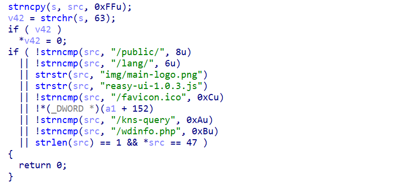

# Tenda AC15 Improper Authentication Bypass Vulnerability(CVE-2025-68453)

## Affected Product

Tenda AC15

## Firmware version

Tenda AC15 v15.03.05.18

## Vulnerability Type Other

CWE-287 (Improper Authentication)

## Description

In Tenda AC15 v15.03.05.18, the `R7WebsSecurityHandler` function within the `/bin/httpd` binary suffers from an improper authentication vulnerability categorized as CWE-287. This vulnerability arises from flawed access control logic in the function’s whitelist verification process. Unauthenticated attackers can bypass the authentication mechanism by constructing malicious URLs that embed specific whitelist substrings in the query parameters. Successful bypass allows attackers to access protected endpoints on the device that are otherwise restricted to authenticated administrators.

## Detail

### 1. Vulnerable Code Snippet

The root cause of the authentication bypass lies in the incorrect handling of URL paths and whitelist verification logic in the `R7WebsSecurityHandler` function.



### 2. Vulnerability Principle Explanation

**URL Truncation Limitation**: The function only truncates the query parameters of the temporary variable `s`, while the original URL (`src`) that contains the complete path and query parameters remains unchanged.

**Insecure Whitelist Matching**: The whitelist verification logic uses `strstr` for substring matching on the original URL (`src`). This means attackers can embed any of the whitelist substrings (e.g., `img/main-logo.png`) in the query parameter section of the URL. The verification logic will identify the substring and trigger the whitelist rule, allowing the request to bypass authentication without any valid credentials.

**Priority of Whitelist Logic**: The whitelist verification is executed before the formal authentication process (such as user login status check and cookie verification). Once the whitelist rule is hit, the function returns `0` immediately, completely skipping subsequent authentication steps.

## POC

```
curl -v --http0.9 "http://192.168.0.1/goform/GetRouterStatus?x=img/main-logo.png"
```

