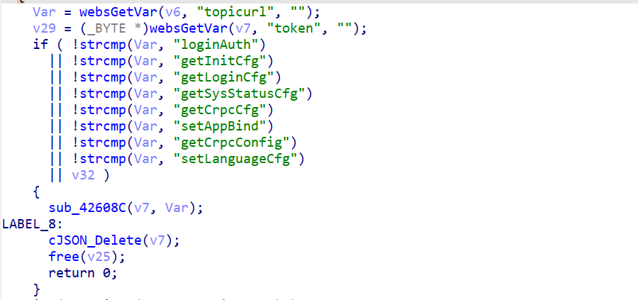

# TOTOLINK X5000R Sensitive Information Disclosure Vulnerability (CVE-2025-XXXXX)

## Affected Product

TOTOLINK X5000R

## Firmware version

TOTOLINK X5000R V9.1.0cu.2350_B20230313

## Vulnerability Type Other

CWE-200 (Exposure of Sensitive Information to an Unauthorized Actor)

## Description

In TOTOLINK X5000R V9.1.0cu.2350_B20230313, the `getSysStatusCfg` function (handled via `sub_42608C` and `sub_41E550`) within the `/web/cgi-bin/cstecgi.cgi` binary contains a sensitive information disclosure vulnerability. This vulnerability arises from a design flaw in the request dispatching logic (`main` function), where specific `topicurl` values are explicitly whitelisted to bypass authentication. Unauthenticated attackers can exploit this by sending a crafted POST request to retrieve critical device configuration, including cleartext Wi-Fi passwords and authentication bypass tokens (`AppBindCode`).

## Detail

### 1. Vulnerable Code Snippet

The root cause of the vulnerability lies in the `main` function of `cstecgi.cgi`. The logic prioritizes the execution of whitelisted actions based on the `topicurl` parameter before performing any session or token verification.



### 2. Vulnerability Principle Explanation

**Insecure Whitelist Design**: The `main` function retrieves the `topicurl` parameter from the incoming JSON request. It then checks this parameter against a hardcoded whitelist (e.g., `getSysStatusCfg`, `getLoginCfg`).

**Authentication Logic Bypass**: If the `topicurl` matches a whitelisted string, the program immediately calls the dispatcher function `sub_42608C` and then exits (via `goto LABEL_8`), explicitly skipping the subsequent code blocks responsible for checking the session cookie (`/tmp/cookie_key`) and token validity.

**Sensitive Data Exposure**: The handler function for `getSysStatusCfg` (`sub_41E550`) is executed without any identity verification. This function queries system configurations using `Uci_Get_Str` and constructs a JSON response containing sensitive information, such as the cleartext WPA/WPA2 PSK key (`WPAPSK1`) and the `AppBindCode` used for mobile app binding.

## POC

```
curl -X POST "http://192.168.0.1/cgi-bin/cstecgi.cgi" -H "Content-Type: application/json" -d "{\"topicurl\": \"getSysStatusCfg\"}"
```

